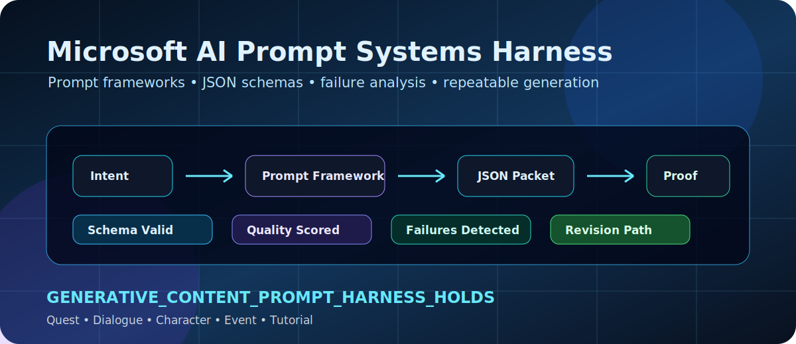

<p align="center">
  
</p>

<h1 align="center">Microsoft AI Prompt Systems Harness</h1>

<p align="center">
  <strong>Structured prompt-design, schema-validation, and evaluation harness for scalable generative content systems.</strong>
</p>

<p align="center">
  
  
  
  
</p>

<p align="center">
  
  
  
  
</p>

---

## Core thesis

A prompt is not successful because it produces one good answer.

A prompt system is successful when it produces structured, validated, repeatable content across topics, tones, audiences, and formats — and when failure cases are visible enough to repair.

This repo treats prompt design as a production system:

```text
intent -> framework -> structured output -> schema validation -> quality scoring -> failure analysis -> revision path -> proof receipt
```

---

## Reviewer command

```bash
python -m app.proof_pack
pytest -q
```

Expected status:

```text
GENERATIVE_CONTENT_PROMPT_HARNESS_HOLDS
```

---

## Role alignment

| Role Requirement | Repo Proof |
|---|---|
| Design and iterate prompts | Prompt framework + iteration loop |
| Build scalable prompt frameworks | Multi-format content generation harness |
| Test outputs and identify failures | Failure detector + failure-mode report |
| Define rules, constraints, and schemas | JSON-style content packet schema |
| Evaluate accuracy, engagement, repeatability | Quality rubric + scoring engine |
| Rapidly prototype and validate | One-command proof pack |
| Work across writing, logic, experimentation | Content system + evaluator + revision path |
| Production-ready content formats | Quest, dialogue, character, event, tutorial packets |

---

## What this proves

```text
schema_valid: true
quality_threshold_met: true
repeatability_threshold_met: true
failure_modes_detected: true
revision_path_available: true
format_coverage: quest, dialogue, event, character, tutorial
```

---

## Content packet contract

Every generated packet must include:

```json
{
  "format": "quest | dialogue | character | event | tutorial",
  "title": "string",
  "audience": "string",
  "tone": "string",
  "content": "string",
  "constraints_satisfied": [],
  "failure_risks": [],
  "revision_notes": []
}
```

---

## Content formats covered

```text
quest      -> objective, motivation, success condition
dialogue   -> voice, intent, emotional clarity
character  -> role, tone, player relevance
event      -> stakes, reward, urgency
tutorial   -> mechanic, sequence, low friction
```

---

## Why this matters

The role is not just prompt writing.

It is building systems that turn ambiguous creative goals into structured, repeatable, testable content workflows.

This harness proves that capability in code.
